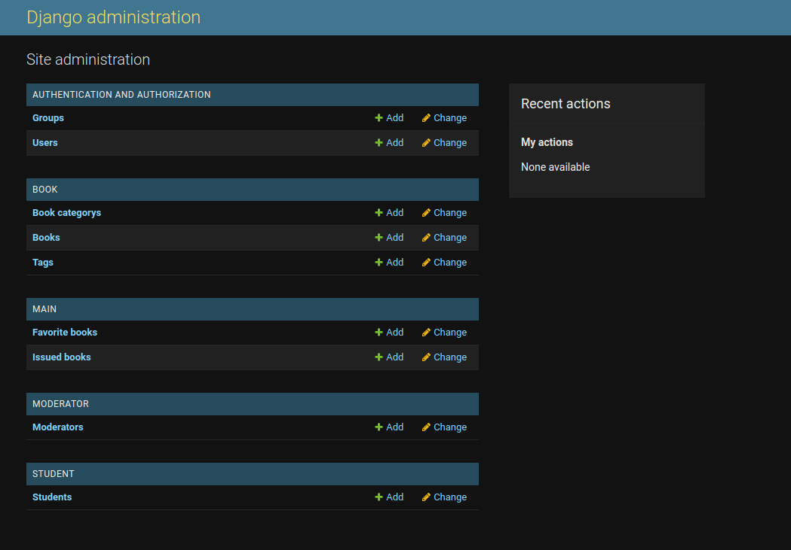
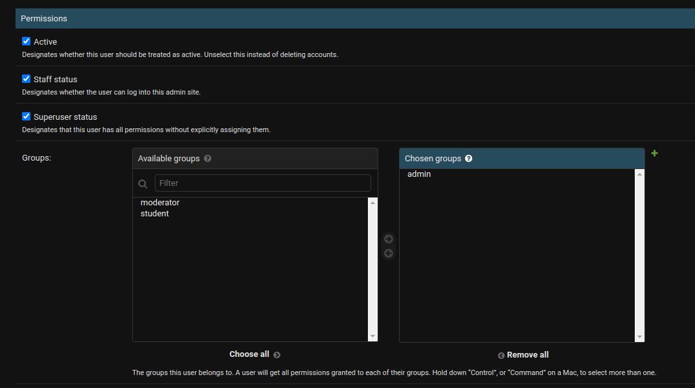
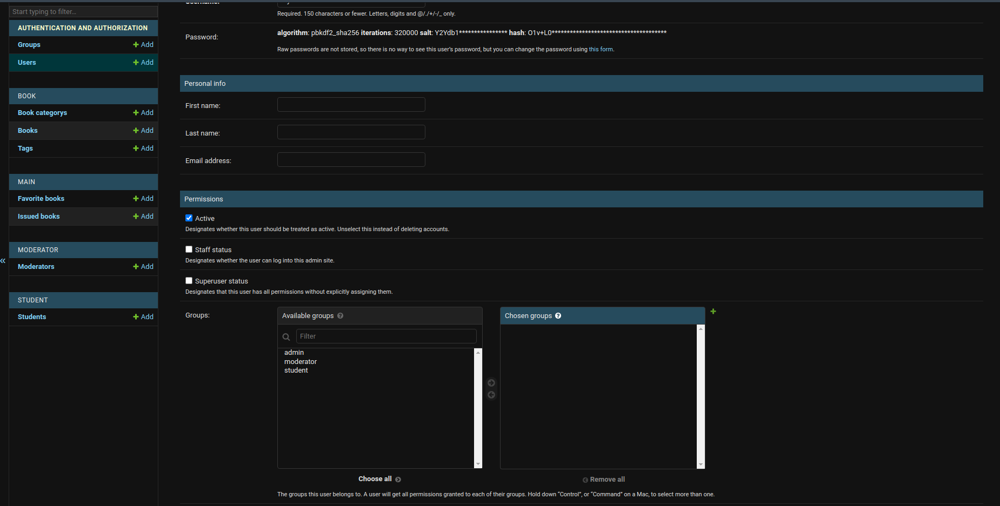
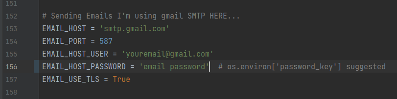
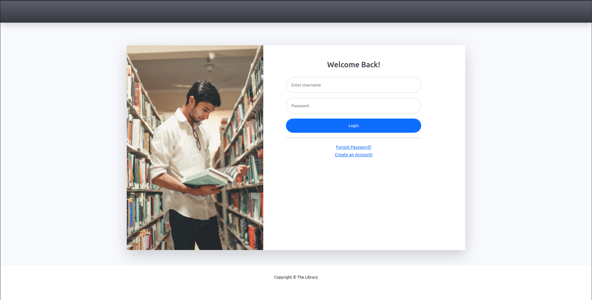

# The Library
This is a web application developed with Django and Python in the back-end, and HTML/CSS/Bootstrap/JavaScript in Front-End.
It submitted as Mini project of ***5th*** Semester.
  The Library web application helps library staff to manage daily operations and keeping the records. Also, it helps students to have access to the available books in the library and view the books they have rented currently or previously from the library. 
It makes daily operations easier for people who work in the library, and it saves a lot of students time. So whenever a student needs to borrow some book from the library they don’t have to visit the library physically to check whether the book is available or not.
 
## Installation
You need to have python installed, and you have to install the required packages from **requirements.txt** file into your virtual environment or system using the following command:
> pip install -r requirements.txt
## Configuration
1. After all the requirements are installed you have to configure the database. You can connect this application to database of your choice, or you can just create the ***sqlite*** ORM db using the following command.
 
Go to the **the-library** directory where **manage.py** file is located and type the following command:
    > python manage.py migrate
2. After the database migration you have to create a superuser. use the following command and provide *username* and *password*:
   > python manage.py createsuperuser
3. Now you have to start the server use the following command:
    > python manage.py runserver
4. If all required packages were installed there shouldn't be any problem with the above command.  
Now open your browser and go to this link: <http://127.0.0.1:8000/admin>
5. Once you are in the Django administration login page, Login using your superuser **username** and **password**.  
You must see this page now: 

6. You have to add the following records in the ***Groups*** table:
   * admin
   * moderator
   * student
7. then go to Users table and click on the *superuser* you have created. Scroll down to Groups Section and add the ***admin*** to the Chosen Groups, Scroll down to the bottom and **save** changes. 

You won't need to use the */admin* link to access the admin panel anymore. The application will check which user groups you are in and redirect you to the related page. 
#### 8. Creating The Moderator User
   You have to create a moderator user to login as moderator, and you can do that through **Django Administration** page only. 
* Click on the **+Add** button in front of the **Users** table in django administration page and create a new user, give the required fields [**username**, **password**, **password confirmation**], then click on **save and continue editing**.   

* Enter the **First Name**, **Last Name**, **Email** and also add **moderator** to the ***Chosen Groups*** list, Then Save it.
* in django administration page click on **+Add** button in front of ****Moderators****. Choose the **User** as you created for moderator, change the **Email Verification** from **0** to **1**, and choose a **photo** file for profile picture. Then Save it
#### 9. Creating the Student User
The student users could be created through login page, or you can create them from the **django administration** page.  
* #### Configuring the Email smtp settings
   If a **student** register themselves to the application they would need to verify theirs email before their joining request gets approved by the **moderator** user. 
In order to *send* emails to the users you have to configure it in ***settings.py*** file - lines(153 - 158), I have kept gmail smtp settings there as a sample. 

## Login
Once the server is running go to <http://127.0.0.1:8000/> and if you are not already logged in you'll get redirected to the **login** page. 
Type the *username* and *password* and the application will automatically check which users group you are in and redirects you to the specific designed page for that user group.

